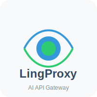

# LingProxy - AI API Gateway

<p align="center">
  
</p>


LingProxy is a high-performance AI API gateway designed for managing and proxying API calls to various AI service providers. It offers OpenAI compatible interfaces, load balancing, circuit breaking, and more.

## Features

### 🚀 Core Features
- **Unified API Interface**: Supports OpenAI compatible API
- **Intelligent Load Balancing**: Supports round-robin load balancing strategy
- **Circuit Breaking**: Automatically detects service failures and triggers circuit breaking to prevent cascading failures
- **Log Tracing**: Complete request chain tracing

### 🔐 Security & Authentication
- **JWT Authentication**: JWT-based user authentication
- **API Key Management**: Secure API key storage and management
- **CORS Support**: Cross-origin resource sharing configuration
- **Rate Limiting**: IP and user-based request rate limiting

### �️ Management Features
- **User Management**: Multi-user support and permission management
- **LLM Resource Management**: Supports multiple AI service provider configurations

## Quick Start

### Requirements
- Go 1.21 or higher
- SQLite (for data storage)

### Installation & Running

1. **Clone the Project**
```bash
git clone https://github.com/wayyoungboy/lingproxy.git
cd lingproxy
```

2. **Install Dependencies**
```bash
go mod tidy
```

3. **Configuration File**
Copy and edit the configuration file:
```bash
cp configs/config.yaml.example configs/config.yaml
# Edit configs/config.yaml to configure as needed
```

4. **Build the Project**
```bash
go build -o lingproxy ./cmd/main.go
```

5. **Run the Service**
```bash
./lingproxy
```

The service will start at `http://localhost:8080`

### Docker Run

```bash
# Build image
docker build -t lingproxy .

# Run container
docker run -p 8080:8080 -v $(pwd)/configs:/app/configs lingproxy
```

## API Usage Guide

### 1. User Registration
```bash
curl -X POST http://localhost:8080/api/v1/users/register \
  -H "Content-Type: application/json" \
  -d '{
    "username": "testuser",
    "email": "test@example.com",
    "password": "password123"
  }'
```

### 2. Get API Key
```bash
curl -X POST http://localhost:8080/api/v1/auth/login \
  -H "Content-Type: application/json" \
  -d '{
    "username": "testuser",
    "password": "password123"
  }'
```

### 3. Proxy AI Request
```bash
curl -X POST http://localhost:8080/api/v1/chat/completions \
  -H "Authorization: Bearer YOUR_API_KEY" \
  -H "Content-Type: application/json" \
  -d '{
    "model": "gpt-3.5-turbo",
    "messages": [
      {"role": "user", "content": "Hello, how are you?"}
    ]
  }'
```

## Configuration

### Main Configuration Items

#### Application Configuration
```yaml
app:
  name: "LingProxy"
  version: "1.0.0"
  environment: "development"  # development, staging, production
  port: 8080
  host: "0.0.0.0"
```

#### Storage Configuration
```yaml
storage:
  type: "gorm"
  gorm:
    driver: "sqlite"
    dsn: "lingproxy.db"
```

#### Security Configuration
```yaml
security:
  cors:
    enabled: true
    allow_origins:
      - "*"
    allow_methods:
      - "GET"
      - "POST"
      - "PUT"
      - "DELETE"
      - "OPTIONS"
    allow_headers:
      - "*"
```

## Monitoring & Operations

### Logging System

#### Log Levels
- **DEBUG**: Detailed debug information, only for development
- **INFO**: General information about system operations
- **WARN**: Warning messages that need attention
- **ERROR**: Error messages that require immediate action
- **FATAL**: Critical errors that cause system shutdown

#### Log Configuration
```yaml
log:
  level: "info"  # debug, info, warn, error, fatal
  format: "json"  # text, json
  output: "stdout"
```

#### Log Viewing
```bash
# View real-time logs
# Logs are output to stdout by default
```

## Development Guide

### Project Structure
```
lingproxy/
├── cmd/                    # Application entry
├── configs/               # Configuration files
├── docs/                  # API documentation
├── internal/              # Internal packages
│   ├── cache/             # Caching implementation
│   ├── client/            # AI service clients
│   │   ├── embedding/     # Embedding clients
│   │   └── openai/        # OpenAI clients
│   ├── config/            # Configuration management
│   ├── handler/           # HTTP handlers
│   ├── middleware/        # HTTP middleware
│   ├── models/            # Data models
│   ├── pkg/               # Internal packages
│   │   ├── balancer/      # Load balancing
│   │   ├── circuitbreaker/ # Circuit breaker
│   │   └── monitor/       # Monitoring
│   ├── router/            # Routing
│   ├── service/           # Business logic
│   └── storage/           # Storage implementation
├── pkg/                   # Public packages
│   └── logger/            # Logging
├── scripts/               # Script files
├── web/                   # Web interface
│   ├── static/            # Static files
│   └── templates/         # HTML templates
└── docker-compose.yml     # Docker configuration
```

### Adding a New AI Provider

1. **Create Provider Configuration**
Add a new provider type in `internal/models/provider.go`

2. **Implement Load Balancing Strategy**
Implement a new load balancing algorithm in `internal/pkg/balancer/`

3. **Add Monitoring Metrics**
Add new monitoring metrics in `internal/pkg/monitor/`

### Testing

```bash
# Run all tests
go test ./...

# Run specific package tests
go test ./internal/pkg/balancer

# Run tests with coverage
go test -cover ./...
```

## Contributing

1. Fork the project
2. Create a feature branch (`git checkout -b feature/AmazingFeature`)
3. Commit your changes (`git commit -m 'Add some AmazingFeature'`)
4. Push to the branch (`git push origin feature/AmazingFeature`)
5. Create a Pull Request

## License

This project is licensed under the MIT License - see the [LICENSE](LICENSE) file for details.

## Support & Contact

- **Issues**: [GitHub Issues](https://github.com/wayyoungboy/lingproxy/issues)
- **Discussions**: [GitHub Discussions](https://github.com/wayyoungboy/lingproxy/discussions)
- **Email**: support@lingproxy.com

## Changelog

### v1.0.0 (2026-01-30)
- Initial release
- Support for OpenAI compatible API
- Implementation of round-robin load balancing and circuit breaking
- Added user management and LLM resource management
- Provided complete REST API interface
- Implemented SQLite-based data storage
- Added logging system with multiple log levels
- Created web-based admin interface

## Language

- [English](README.md) (current)
- [中文](README_zh.md)