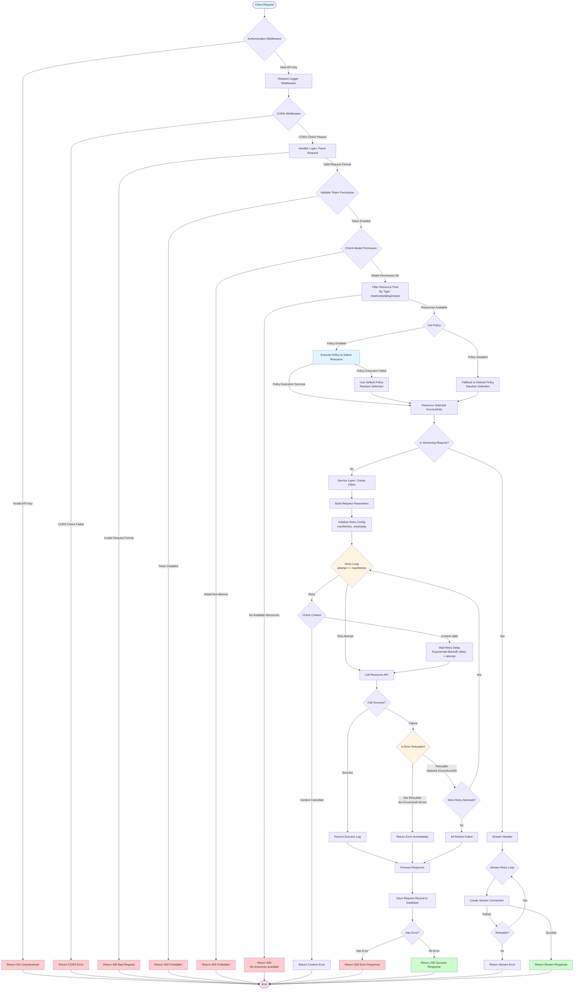

# Architecture Guide

## System Architecture

LingProxy follows a modern microservices architecture with clear separation of concerns:

```
┌─────────────┐
│   Frontend  │  Vue 3 + Element Plus
│  (Port 3000)│
└──────┬──────┘
       │ HTTP/REST API
┌──────▼──────────────────┐
│      Backend API        │  Go + Gin
│     (Port 8080)         │
├──────────────────────────┤
│  ┌────────────────────┐ │
│  │   HTTP Handlers    │ │  Request processing
│  └──────────┬─────────┘ │
│  ┌──────────▼─────────┐ │
│  │   Middleware       │ │  Auth, CORS, Logging
│  └──────────┬─────────┘ │
│  ┌──────────▼─────────┐ │
│  │   Services         │ │  Business logic
│  └──────────┬─────────┘ │
│  ┌──────────▼─────────┐ │
│  │   Storage Layer    │ │  Data persistence
│  └────────────────────┘ │
└──────────────────────────┘
       │
┌──────▼──────┐
│   Database  │  SQLite/MySQL/PostgreSQL
└─────────────┘
```

## Frontend Architecture

### Technology Stack
- **Framework**: Vue 3 (Composition API)
- **UI Component Library**: Element Plus
- **Build Tool**: Vite
- **Internationalization**: vue-i18n
- **Routing**: Vue Router
- **HTTP Client**: Axios

### Directory Structure
```
frontend/
├── src/
│   ├── api/              # API client
│   ├── assets/           # Static assets
│   ├── components/       # Vue components
│   │   ├── Layout.vue    # Layout component (includes language switcher)
│   │   └── Sidebar.vue   # Sidebar component
│   ├── config/           # Configuration files
│   │   └── menu.js       # Menu configuration
│   ├── locales/          # Internationalization language packs
│   │   ├── zh/           # Chinese language pack
│   │   ├── en/           # English language pack
│   │   └── index.js      # i18n configuration
│   ├── router/           # Route configuration
│   ├── views/            # Page views
│   │   ├── Login.vue
│   │   ├── Dashboard.vue
│   │   ├── Tokens.vue
│   │   ├── LLMResources.vue
│   │   ├── LLMResourceUsage.vue
│   │   ├── Requests.vue
│   │   ├── Policies.vue
│   │   ├── Settings.vue
│   │   ├── Logs.vue
│   │   ├── Models.vue
│   │   ├── Users.vue
│   │   └── Endpoints.vue
│   ├── App.vue           # Root component
│   └── main.js           # Entry point
├── package.json
└── vite.config.js
```

### Internationalization Support
- **Language Packs**: Complete Chinese and English language packs
- **Language Switching**: Support for runtime language switching, settings saved in localStorage
- **Element Plus Integration**: Element Plus component language automatically follows system language settings
- **Coverage**: All user interface text, error messages, and form validation messages are internationalized

### Core Feature Modules
- **Authentication**: Login page, JWT API Key management
- **Dashboard**: System overview and statistics
- **Resource Management**: LLM resources, models, endpoints management
- **Policy Management**: Routing policy configuration and management
- **Request Management**: Request log viewing and export
- **Usage Statistics**: Detailed statistics grouped by resource
- **System Settings**: Dynamic configuration management
- **Log Management**: System log viewing and management

## Backend Architecture

### Directory Structure

```
backend/
├── cmd/
│   └── main.go              # Application entry point
├── configs/
│   └── config.yaml.example  # Configuration template
├── internal/
│   ├── cache/               # Cache implementation
│   ├── client/              # AI service clients
│   │   ├── embedding/       # Embedding client
│   │   └── openai/          # OpenAI client
│   ├── config/              # Configuration management
│   ├── handler/             # HTTP handlers
│   ├── middleware/          # HTTP middleware
│   ├── pkg/                 # Internal utilities
│   │   ├── balancer/        # Load balancer
│   │   ├── logger/         # Logging utilities
│   │   ├── monitor/        # Monitoring utilities
│   │   └── password/       # Password utilities
│   ├── router/             # Route configuration
│   ├── service/            # Business logic services
│   └── storage/            # Storage layer
│       ├── models.go       # Data models
│       ├── storage.go      # Storage interface
│       ├── storage_facade.go # Storage facade
│       ├── memory_storage.go # Memory implementation
│       └── gorm_storage.go   # GORM implementation
└── swagger/                # API documentation
```

### Layer Architecture

#### 1. Handler Layer
- **Purpose**: HTTP request/response handling
- **Responsibilities**:
  - Parse HTTP requests
  - Validate input data
  - Call service layer
  - Format HTTP responses
- **Files**: `internal/handler/*.go`

#### 2. Service Layer
- **Purpose**: Business logic implementation
- **Responsibilities**:
  - Implement business rules
  - Coordinate between handlers and storage
  - Handle complex operations
- **Files**: `internal/service/*.go`

#### 3. Storage Layer
- **Purpose**: Data persistence abstraction
- **Responsibilities**:
  - Define storage interface
  - Implement storage backends (memory, GORM)
  - Handle data operations
- **Files**: `internal/storage/*.go`

#### 4. Middleware Layer
- **Purpose**: Cross-cutting concerns
- **Responsibilities**:
  - Authentication
  - CORS handling
  - Request logging
  - Rate limiting
- **Files**: `internal/middleware/*.go`

## Data Models

### Core Models

#### User
```go
type User struct {
    ID           string
    Username     string
    PasswordHash string
    APIKey       string
    Role         string    // admin
    Status       string    // active, inactive, suspended
    LastLoginAt  *time.Time
    CreatedAt    time.Time
    UpdatedAt    time.Time
}
```

#### LLMResource
```go
type LLMResource struct {
    ID        string
    Name      string
    Type      string    // chat, image, embedding, etc.
    Driver    string    // openai (currently only openai)
    Model     string
    BaseURL   string
    APIKey    string
    Status    string
    CreatedAt time.Time
    UpdatedAt time.Time
}
```

#### Token
```go
type Token struct {
    ID         string
    Name       string
    Token      string
    Prefix     string
    Status     string
    PolicyID   string
    LastUsedAt *time.Time
    ExpiresAt  *time.Time
    CreatedAt  time.Time
    UpdatedAt  time.Time
}
```

#### Policy
```go
type Policy struct {
    ID         string
    Name       string
    TemplateID string
    Type       string    // round_robin, random, etc.
    Parameters string    // JSON
    Enabled    bool
    Builtin    bool
    CreatedAt  time.Time
    UpdatedAt  time.Time
}
```

## Request Flow

### Complete OpenAI-Compatible API Request Flow

The following flowchart shows the complete flow from client request to resource response, including all middleware, policy selection, retry mechanisms, and error handling branches:



### Flow Description

#### 1. Request Entry Stage
- **Client Request**: Client sends HTTP request to LingProxy
- **Authentication Middleware**: Validates API Key, returns 401 if invalid
- **Request Logger Middleware**: Logs request details
- **CORS Middleware**: Handles cross-origin requests

#### 2. Handler Layer Processing
- **Parse Request**: Validates request format, returns 400 if invalid
- **Token Validation**: Checks if token is enabled, returns 403 if disabled
- **Model Permission Check**: Validates if requested model is in token's allowed list
- **Resource Filtering**: Filters resource pool by request type (chat/embedding/rerank)

#### 3. Policy Selection Stage
- **Get Policy**: Retrieves policy ID from token configuration
- **Policy Execution**: Executes policy to select resource (random/round-robin/weighted/match, etc.)
- **Fallback Handling**: Uses default random policy if policy fails or is disabled

#### 4. Service Layer Call
- **Create Client**: Creates OpenAI client based on selected resource
- **Build Parameters**: Prepares request parameters (model, messages, etc.)
- **Initialize Retry**: Reads retry configuration (max retries, retry delay)

#### 5. Retry Mechanism
- **Retry Loop**: Retries up to `maxRetries` times (default: 3)
- **Exponential Backoff**: Each retry delay = `retryDelay × attempt`
- **Retryable Errors**:
  - ✅ Network errors (connection failure, timeout)
  - ✅ 5xx server errors (500, 502, 503, 504)
  - ✅ 429 rate limit errors
- **Non-Retryable Errors**:
  - ❌ 4xx client errors (400, 401, 403, 404)
  - ❌ Context cancellation
  - ❌ Invalid request parameters

#### 6. Response Processing
- **Success Response**: Logs success, saves request record, returns 200
- **Failure Response**: Logs error, saves failure record, returns 500
- **Stream Response**: Special handling for streaming requests with stream retry support

### Key Decision Points

| Decision Point | Condition | Result |
|----------------|-----------|--------|
| Authentication Check | Invalid API Key | Return 401 |
| Token Status | Token Disabled | Return 403 |
| Model Permission | Model Not in Allowed List | Return 403 |
| Resource Availability | No Available Resources | Return 500 |
| Policy Execution | Policy Failed | Fallback to Default Policy |
| Retry Decision | Error Retryable and Under Limit | Continue Retry |
| Retry Decision | Error Not Retryable or Over Limit | Return Error |

### Retry Mechanism Details

**Retry Configuration**:
- `maxRetries`: Maximum retry count (default: 3, 0 = disabled)
- `retryDelay`: Base retry delay (default: 1 second)

**Retry Delay Calculation**:
```
1st Retry: delay × 1 = 1 second
2nd Retry: delay × 2 = 2 seconds
3rd Retry: delay × 3 = 3 seconds
```

**Retry Scope**:
- ✅ Retries **the same resource**
- ❌ Does not re-execute policy to select new resource
- ✅ Supports exponential backoff strategy
- ✅ Supports Context cancellation detection

### Error Handling Branches

1. **Authentication Error** (401): Invalid or missing API Key
2. **Permission Error** (403): Token disabled or model not in allowed list
3. **Request Error** (400): Invalid request format or parameters
4. **Resource Error** (500): No available resources or policy execution failed
5. **Service Error** (500): Resource API call failed (after retries)
6. **Stream Error**: Stream connection creation failed

### Management API Request

```
1. Client Request
   ↓
2. Authentication Middleware
   - Validate admin credentials
   ↓
3. Handler
   - Parse request
   - Validate input
   ↓
4. Service Layer
   - Execute business logic
   - Update storage
   ↓
5. Storage Layer
   - Persist changes
   ↓
6. Response
   - Return result
```

## Storage Backends

### Memory Storage
- **Use Case**: Development and testing
- **Characteristics**: Fast, ephemeral, no persistence
- **Implementation**: `memory_storage.go`

### GORM Storage
- **Use Case**: Production environments
- **Characteristics**: Persistent, supports SQLite/MySQL/PostgreSQL
- **Implementation**: `gorm_storage.go`

## Security Architecture

### Authentication Flow

```
1. Client sends request with API key/token
   ↓
2. Auth Middleware extracts credentials
   ↓
3. Validate credentials:
   - Check token in TokenService
   - Or check API key in User storage
   ↓
4. Set user context
   ↓
5. Continue to handler
```

### Password Security
- Passwords are hashed using bcrypt
- Never stored in plain text
- Password verification uses constant-time comparison

## Load Balancing

### Supported Strategies
- **Round Robin**: Distribute requests sequentially
- **Random**: Random selection
- **Weighted**: Weighted distribution
- **Model Match**: Match by model name
- **Regex Match**: Match by pattern
- **Regex Model Match**: Use request model name as regex to match resources
- **Priority**: Priority-based selection
- **Failover**: Automatic failover

## Policy Types Explained

LingProxy provides 8 built-in routing policies, each suitable for different use cases. The following is a detailed explanation of each policy:

### 1. Random Selection Policy

**Type Identifier**: `random`

**How It Works**:
- Randomly selects one resource from the available resource pool
- Uses cryptographically secure random number generator for true randomness
- Supports resource pool configuration and status filtering

**Configuration Parameters**:
```json
{
  "resources": ["resource-id-1", "resource-id-2"],  // Optional: specify resource pool, empty means all resources
  "filter_by_status": true  // Optional: only select active resources (default: true)
}
```

**Use Cases**:
- Need to evenly distribute load across multiple resources
- Resources have similar performance, no special scheduling needed
- Simple load balancing requirements

**Example**:
```json
{
  "name": "Random Load Balancing",
  "template_id": "random-template-id",
  "parameters": {
    "resources": ["gpt-4-resource-1", "gpt-4-resource-2"],
    "filter_by_status": true
  }
}
```

**Characteristics**:
- ✅ Simple and easy to use
- ✅ Even load distribution
- ✅ Supports resource pool limitation
- ❌ Doesn't consider resource performance differences
- ❌ Cannot guarantee resource utilization

---

### 2. Round Robin Load Balancing Policy

**Type Identifier**: `round_robin`

**How It Works**:
- Selects resources sequentially in order
- Each policy instance maintains an independent index counter
- Thread-safe, supports concurrent requests

**Configuration Parameters**:
```json
{
  "resources": ["resource-id-1", "resource-id-2", "resource-id-3"],  // Required: resource list (in order)
  "filter_by_status": true  // Optional: only select active resources (default: true)
}
```

**Use Cases**:
- Need sequential request distribution
- Resources have similar performance
- Need predictable resource allocation pattern

**Example**:
```json
{
  "name": "Round Robin Load Balancing",
  "template_id": "round_robin-template-id",
  "parameters": {
    "resources": ["resource-1", "resource-2", "resource-3"],
    "filter_by_status": true
  }
}
```

**Characteristics**:
- ✅ Predictable request distribution
- ✅ Even load distribution
- ✅ Thread-safe
- ❌ Doesn't consider resource performance differences
- ❌ Fixed resource order

---

### 3. Weighted Load Balancing Policy

**Type Identifier**: `weighted`

**How It Works**:
- Allocates requests based on resource weights
- Higher weight means higher probability of being selected
- Uses weighted random algorithm to select resources

**Configuration Parameters**:
```json
{
  "resources": [
    {"id": "resource-id-1", "weight": 3},  // Weight 3
    {"id": "resource-id-2", "weight": 2},  // Weight 2
    {"id": "resource-id-3", "weight": 1}   // Weight 1
  ],
  "filter_by_status": true  // Optional: only select active resources (default: true)
}
```

**Use Cases**:
- Significant performance differences between resources
- Need to allocate load proportionally to performance
- High-performance resources need to handle more requests

**Example**:
```json
{
  "name": "Weighted Load Balancing",
  "template_id": "weighted-template-id",
  "parameters": {
    "resources": [
      {"id": "high-performance-resource", "weight": 5},
      {"id": "medium-performance-resource", "weight": 3},
      {"id": "low-performance-resource", "weight": 1}
    ],
    "filter_by_status": true
  }
}
```

**Characteristics**:
- ✅ Considers resource performance differences
- ✅ Flexible weight configuration
- ✅ More reasonable load distribution
- ❌ Relatively complex configuration
- ❌ Need to understand resource performance

---

### 4. Model Name Matching Policy

**Type Identifier**: `model_match`

**How It Works**:
- Matches resources based on the requested model name
- Supports wildcard patterns (`*` matches any characters)
- Supports default resource configuration as fallback

**Configuration Parameters**:
```json
{
  "mappings": [
    {
      "model_pattern": "gpt-4*",  // Model name pattern (supports wildcards)
      "resource_id": "gpt-4-resource"
    },
    {
      "model_pattern": "claude-3*",
      "resource_id": "claude-resource"
    }
  ],
  "default_resource_id": "default-resource"  // Optional: default resource
}
```

**Use Cases**:
- Different models need to route to different resources
- Need exact or pattern matching based on model names
- Need dedicated resources for specific models

**Example**:
```json
{
  "name": "Model Matching Policy",
  "template_id": "model_match-template-id",
  "parameters": {
    "mappings": [
      {"model_pattern": "gpt-4*", "resource_id": "openai-gpt4"},
      {"model_pattern": "gpt-3.5*", "resource_id": "openai-gpt35"},
      {"model_pattern": "claude*", "resource_id": "anthropic-claude"}
    ],
    "default_resource_id": "fallback-resource"
  }
}
```

**Characteristics**:
- ✅ Precise model routing control
- ✅ Supports wildcard patterns
- ✅ Supports default resource fallback
- ❌ Need to pre-configure all model patterns
- ❌ New models require configuration updates

---

### 5. Regex Matching Policy

**Type Identifier**: `regex_match`

**How It Works**:
- Uses regular expressions to match requested model names
- Supports complex matching rules
- Supports default resource configuration as fallback

**Configuration Parameters**:
```json
{
  "rules": [
    {
      "pattern": "^gpt-4.*",  // Regular expression pattern
      "resource_id": "gpt-4-resource"
    },
    {
      "pattern": ".*-turbo$",
      "resource_id": "turbo-resource"
    }
  ],
  "default_resource_id": "default-resource"  // Optional: default resource
}
```

**Use Cases**:
- Need complex model name matching rules
- Need to match model name prefixes, suffixes, or middle parts
- Need more flexible matching patterns

**Example**:
```json
{
  "name": "Regex Matching Policy",
  "template_id": "regex_match-template-id",
  "parameters": {
    "rules": [
      {"pattern": "^gpt-4.*", "resource_id": "gpt4-resource"},
      {"pattern": "^gpt-3\\.5.*", "resource_id": "gpt35-resource"},
      {"pattern": ".*-turbo$", "resource_id": "turbo-resource"}
    ],
    "default_resource_id": "fallback-resource"
  }
}
```

**Characteristics**:
- ✅ Powerful matching capabilities
- ✅ Supports complex regular expressions
- ✅ Supports default resource fallback
- ❌ Requires regex knowledge
- ❌ Slightly lower performance than simple matching

---

### 6. Regex Model Matching Policy

**Type Identifier**: `regex_model_match`

**How It Works**:
- Uses the model name from the request as a regular expression
- Matches resource model names in the pool using this regex
- Randomly selects one from matched resources

**Configuration Parameters**:
```json
{
  "resources": ["resource-id-1", "resource-id-2"],  // Optional: specify resource pool, empty means all resources
  "filter_by_status": true  // Optional: only select active resources (default: true)
}
```

**Use Cases**:
- Need dynamic regex matching rules
- Request side can flexibly specify matching patterns
- Need to randomly select from multiple matched resources

**Example**:
```json
{
  "name": "Dynamic Regex Matching",
  "template_id": "regex_model_match-template-id",
  "parameters": {
    "resources": ["resource-1", "resource-2", "resource-3"],
    "filter_by_status": true
  }
}
```

**Usage**:
The model name from the request will be used as a regular expression:
```bash
POST /llm/v1/chat/completions
{
  "model": "^gpt-4.*",  // This model name will be used as a regex
  "messages": [...]
}
```

**Characteristics**:
- ✅ Highly flexible, dynamic matching
- ✅ Request side can control matching rules
- ✅ Supports resource pool limitation
- ❌ Requires request side to understand regex
- ⚠️ Need to be aware of ReDoS security risks

---

### 7. Priority Policy

**Type Identifier**: `priority`

**How It Works**:
- Selects resources in priority order
- Prefers higher priority resources (smaller number = higher priority)
- Supports fallback mechanism, uses lower priority resources when higher priority ones are unavailable

**Configuration Parameters**:
```json
{
  "resources": [
    {"id": "resource-id-1", "priority": 1},  // Priority 1 (highest)
    {"id": "resource-id-2", "priority": 2},  // Priority 2
    {"id": "resource-id-3", "priority": 3}   // Priority 3
  ],
  "fallback_enabled": true  // Optional: enable fallback (default: true)
}
```

**Use Cases**:
- Have primary/backup resource concept
- Need to prioritize specific resources
- Need resource fallback mechanism

**Example**:
```json
{
  "name": "Priority Policy",
  "template_id": "priority-template-id",
  "parameters": {
    "resources": [
      {"id": "primary-resource", "priority": 1},
      {"id": "secondary-resource", "priority": 2},
      {"id": "tertiary-resource", "priority": 3}
    ],
    "fallback_enabled": true
  }
}
```

**Characteristics**:
- ✅ Clear resource priorities
- ✅ Supports automatic fallback
- ✅ Clear configuration
- ❌ Doesn't consider load balancing
- ❌ High priority resources may be overloaded

---

### 8. Failover Policy

**Type Identifier**: `failover`

**How It Works**:
- Configures primary and fallback resources
- Prefers primary resource
- Automatically switches to fallback resources when primary is unavailable
- Supports health check mechanism

**Configuration Parameters**:
```json
{
  "primary_resource_id": "primary-resource-id",  // Required: primary resource ID
  "fallback_resources": ["fallback-1", "fallback-2"],  // Required: fallback resource list
  "health_check_enabled": true,  // Optional: enable health check (default: true)
  "health_check_interval": 30  // Optional: health check interval in seconds (default: 30)
}
```

**Use Cases**:
- Need high availability
- Have clear primary/backup resources
- Need automatic failover

**Example**:
```json
{
  "name": "Failover Policy",
  "template_id": "failover-template-id",
  "parameters": {
    "primary_resource_id": "main-resource",
    "fallback_resources": ["backup-resource-1", "backup-resource-2"],
    "health_check_enabled": true,
    "health_check_interval": 30
  }
}
```

**Characteristics**:
- ✅ High availability guarantee
- ✅ Automatic failover
- ✅ Supports health checks
- ❌ Relatively complex configuration
- ❌ Won't use fallback resources until primary fails

---

## Policy Selection Guide

### Select by Use Case

| Scenario | Recommended Policy | Reason |
|----------|-------------------|--------|
| Simple load balancing | Random / Round Robin | Simple and easy, even load |
| Large resource performance differences | Weighted | Allocate load by performance |
| Model routing | Model Match / Regex Match | Precise routing control |
| Dynamic matching needs | Regex Model Match | Flexible dynamic matching |
| Primary/backup architecture | Priority / Failover | Clear priority and failover |
| High availability needs | Failover | Automatic failover |

### Policy Comparison Table

| Policy | Complexity | Flexibility | Load Balancing | Availability | Performance Consideration |
|--------|-----------|-------------|----------------|--------------|---------------------------|
| Random | Low | Medium | High | Medium | Low |
| Round Robin | Low | Low | High | Medium | Low |
| Weighted | Medium | Medium | High | Medium | Medium |
| Model Match | Medium | High | Low | Medium | Low |
| Regex Match | Medium | High | Low | Medium | Medium |
| Regex Model Match | Medium | Very High | Medium | Medium | Medium |
| Priority | Medium | Low | Low | High | Low |
| Failover | High | Low | Low | Very High | Medium |

### Best Practices

1. **Resource Pool Configuration**: Most policies support resource pool configuration, recommend explicitly specifying resource pools for better performance and predictability
2. **Status Filtering**: Recommend enabling `filter_by_status` to ensure only active resources are used
3. **Default Resource**: For matching policies, recommend configuring default resources as fallback
4. **Health Checks**: For failover policies, recommend enabling health checks
5. **Weight Configuration**: Weights in weighted policies should reflect actual resource performance differences
6. **Regular Expressions**: When using regex matching, pay attention to performance and security (avoid ReDoS)

## Configuration Management

### Configuration Sources (Priority Order)
1. Environment variables (`LINGPROXY_*`)
2. Configuration file (`config.yaml`)
3. Default values (in code)

### Configuration Structure
- Application settings
- Storage configuration
- Log configuration
- Security settings

## Error Handling

### Error Types
- **Validation Errors**: 400 Bad Request
- **Authentication Errors**: 401 Unauthorized
- **Not Found Errors**: 404 Not Found
- **Server Errors**: 500 Internal Server Error

### Error Response Format
```json
{
  "error": "Error message"
}
```

### Automatic Retry Mechanism

LingProxy includes a configurable automatic retry mechanism for resource requests:

**Retryable Errors:**
- Network errors (connection failures, timeouts)
- 5xx server errors (500, 502, 503, 504)
- 429 rate limit errors
- Temporary service unavailability

**Non-Retryable Errors:**
- 4xx client errors (except 429)
- Authentication errors (401, 403)
- Context cancellations
- Invalid request parameters

**Retry Configuration:**
- **Max Retries**: Configurable via admin interface (default: 3, 0 = disabled)
- **Retry Delay**: Base delay between retries (default: 1s)
- **Exponential Backoff**: Actual delay = retry_delay × attempt_number
- **Scope**: Applies to all request types (chat completions, text completions, embeddings, streaming)

**Configuration:**
- Managed via admin interface: Settings → Provider Settings
- Changes take effect immediately without restart
- Stored in `config.yaml` under `provider` section

## Logging

### Log Levels
- **Debug**: Detailed debugging information
- **Info**: General informational messages
- **Warn**: Warning messages
- **Error**: Error messages
- **Fatal**: Fatal errors

### Log Output
- Console (stdout)
- File (rotated logs)
- Both (recommended)

## Performance Considerations

### Caching
- In-memory caching for frequently accessed data
- Configurable TTL

### Connection Pooling
- HTTP client connection pooling
- Configurable pool size

### Database Optimization
- Indexed queries
- Efficient data models
- Connection pooling
