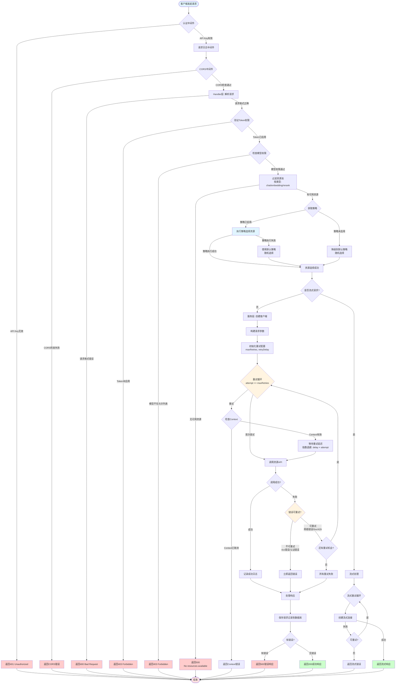

# 架构指南

## 系统架构

LingProxy 采用现代微服务架构，关注点分离清晰：

```
┌─────────────┐
│   前端      │  Vue 3 + Element Plus
│  (端口 3000)│
└──────┬──────┘
       │ HTTP/REST API
┌──────▼──────────────────┐
│      后端 API           │  Go + Gin
│     (端口 8080)         │
├──────────────────────────┤
│  ┌────────────────────┐ │
│  │   HTTP 处理器      │ │  请求处理
│  └──────────┬─────────┘ │
│  ┌──────────▼─────────┐ │
│  │   中间件           │ │  认证、CORS、日志
│  └──────────┬─────────┘ │
│  ┌──────────▼─────────┐ │
│  │   服务层           │ │  业务逻辑
│  └──────────┬─────────┘ │
│  ┌──────────▼─────────┐ │
│  │   存储层           │ │  数据持久化
│  └────────────────────┘ │
└──────────────────────────┘
       │
┌──────▼──────┐
│   数据库    │  SQLite/MySQL/PostgreSQL
└─────────────┘
```

## 前端架构

### 技术栈
- **框架**: Vue 3 (Composition API)
- **UI 组件库**: Element Plus
- **构建工具**: Vite
- **国际化**: vue-i18n
- **路由**: Vue Router
- **HTTP 客户端**: Axios

### 目录结构
```
frontend/
├── src/
│   ├── api/              # API 客户端
│   ├── assets/           # 静态资源
│   ├── components/       # Vue 组件
│   │   ├── Layout.vue    # 布局组件（包含语言切换）
│   │   └── Sidebar.vue   # 侧边栏组件
│   ├── config/           # 配置文件
│   │   └── menu.js       # 菜单配置
│   ├── locales/          # 国际化语言包
│   │   ├── zh/           # 中文语言包
│   │   ├── en/           # 英文语言包
│   │   └── index.js      # i18n 配置
│   ├── router/           # 路由配置
│   ├── views/            # 页面视图
│   │   ├── Login.vue
│   │   ├── Dashboard.vue
│   │   ├── Tokens.vue
│   │   ├── LLMResources.vue
│   │   ├── LLMResourceUsage.vue
│   │   ├── Requests.vue
│   │   ├── Policies.vue
│   │   ├── Settings.vue
│   │   ├── Logs.vue
│   │   ├── Models.vue
│   │   ├── Users.vue
│   │   └── Endpoints.vue
│   ├── App.vue           # 根组件
│   └── main.js           # 入口文件
├── package.json
└── vite.config.js
```

### 国际化支持
- **语言包**: 完整的中文和英文语言包
- **语言切换**: 支持在运行时切换语言，设置保存在 localStorage
- **Element Plus 集成**: Element Plus 组件语言自动跟随系统语言设置
- **覆盖范围**: 所有用户界面文本、错误消息、表单验证消息均已国际化

### 核心功能模块
- **认证**: 登录页面，JWT API Key 管理
- **仪表盘**: 系统概览和统计信息
- **资源管理**: LLM 资源、模型、端点管理
- **策略管理**: 路由策略配置和管理
- **请求管理**: 请求日志查看和导出
- **用量统计**: 按资源分组的详细统计信息
- **系统设置**: 动态配置管理
- **日志管理**: 系统日志查看和管理

## 后端架构

### 目录结构

```
backend/
├── cmd/
│   └── main.go              # 应用入口
├── configs/
│   └── config.yaml.example  # 配置模板
├── internal/
│   ├── cache/               # 缓存实现
│   ├── client/              # AI 服务客户端
│   │   ├── embedding/       # 嵌入客户端
│   │   └── openai/          # OpenAI 客户端
│   ├── config/              # 配置管理
│   ├── handler/             # HTTP 处理器
│   ├── middleware/          # HTTP 中间件
│   ├── pkg/                 # 内部工具包
│   │   ├── balancer/        # 负载均衡
│   │   ├── logger/          # 日志工具
│   │   ├── monitor/         # 监控工具
│   │   └── password/        # 密码工具
│   ├── router/              # 路由配置
│   ├── service/             # 业务逻辑服务
│   └── storage/             # 存储层
│       ├── models.go        # 数据模型
│       ├── storage.go       # 存储接口
│       ├── storage_facade.go # 存储门面
│       ├── memory_storage.go # 内存实现
│       └── gorm_storage.go   # GORM 实现
└── swagger/                 # API 文档
```

### 分层架构

#### 1. Handler 层
- **目的**：HTTP 请求/响应处理
- **职责**：
  - 解析 HTTP 请求
  - 验证输入数据
  - 调用服务层
  - 格式化 HTTP 响应
- **文件**：`internal/handler/*.go`

#### 2. Service 层
- **目的**：业务逻辑实现
- **职责**：
  - 实现业务规则
  - 协调处理器和存储层
  - 处理复杂操作
- **文件**：`internal/service/*.go`

#### 3. Storage 层
- **目的**：数据持久化抽象
- **职责**：
  - 定义存储接口
  - 实现存储后端（内存、GORM）
  - 处理数据操作
- **文件**：`internal/storage/*.go`

#### 4. Middleware 层
- **目的**：横切关注点
- **职责**：
  - 认证
  - CORS 处理
  - 请求日志
  - 限流
- **文件**：`internal/middleware/*.go`

## 数据模型

### 核心模型

#### User
```go
type User struct {
    ID           string
    Username     string
    PasswordHash string
    APIKey       string
    Role         string    // admin
    Status       string    // active, inactive, suspended
    LastLoginAt  *time.Time
    CreatedAt    time.Time
    UpdatedAt    time.Time
}
```

#### LLMResource
```go
type LLMResource struct {
    ID        string
    Name      string
    Type      string    // chat, image, embedding 等
    Driver    string    // openai（目前仅支持 openai）
    Model     string
    BaseURL   string
    APIKey    string
    Status    string
    CreatedAt time.Time
    UpdatedAt time.Time
}
```

#### Token
```go
type Token struct {
    ID         string
    Name       string
    Token      string
    Prefix     string
    Status     string
    PolicyID   string
    LastUsedAt *time.Time
    ExpiresAt  *time.Time
    CreatedAt  time.Time
    UpdatedAt  time.Time
}
```

#### Policy
```go
type Policy struct {
    ID         string
    Name       string
    TemplateID string
    Type       string    // round_robin, random 等
    Parameters string    // JSON
    Enabled    bool
    Builtin    bool
    CreatedAt  time.Time
    UpdatedAt  time.Time
}
```

## 请求流程

### OpenAI 兼容 API 请求完整流程图

以下流程图展示了从客户端请求到资源侧响应的完整流程，包括所有中间件、策略选择、重试机制和错误处理分支：



### 流程说明

#### 1. 请求入口阶段
- **客户端请求**: 客户端发送 HTTP 请求到 LingProxy
- **认证中间件**: 验证 API Key，无效则返回 401
- **请求日志中间件**: 记录请求详情
- **CORS 中间件**: 处理跨域请求

#### 2. Handler 层处理
- **解析请求**: 验证请求格式，错误返回 400
- **Token 验证**: 检查 Token 是否启用，禁用返回 403
- **模型权限检查**: 验证请求的模型是否在 Token 允许列表中
- **资源过滤**: 根据请求类型（chat/embedding/rerank）过滤资源池

#### 3. 策略选择阶段
- **获取策略**: 从 Token 配置中获取策略ID
- **策略执行**: 执行策略选择资源（随机/轮询/加权/匹配等）
- **降级处理**: 策略失败或未启用时，使用默认随机策略

#### 4. 服务层调用
- **创建客户端**: 根据选定的资源创建 OpenAI 客户端
- **构建参数**: 准备请求参数（模型、消息等）
- **初始化重试**: 读取重试配置（最大重试次数、重试延迟）

#### 5. 重试机制
- **重试循环**: 最多重试 `maxRetries` 次（默认3次）
- **指数退避**: 每次重试延迟 = `retryDelay × attempt`
- **可重试错误**: 
  - ✅ 网络错误（连接失败、超时）
  - ✅ 5xx 服务器错误（500、502、503、504）
  - ✅ 429 限流错误
- **不可重试错误**:
  - ❌ 4xx 客户端错误（400、401、403、404）
  - ❌ Context 取消
  - ❌ 无效请求参数

#### 6. 响应处理
- **成功响应**: 记录日志，保存请求记录，返回 200
- **失败响应**: 记录错误日志，保存失败记录，返回 500
- **流式响应**: 特殊处理流式请求，支持流式重试

### 关键决策点

| 决策点 | 条件 | 结果 |
|--------|------|------|
| 认证检查 | API Key 无效 | 返回 401 |
| Token 状态 | Token 未启用 | 返回 403 |
| 模型权限 | 模型不在允许列表 | 返回 403 |
| 资源可用性 | 无可用资源 | 返回 500 |
| 策略执行 | 策略失败 | 降级到默认策略 |
| 重试判断 | 错误可重试且未达上限 | 继续重试 |
| 重试判断 | 错误不可重试或已达上限 | 返回错误 |

### 重试机制详解

**重试配置**:
- `maxRetries`: 最大重试次数（默认 3，0 = 禁用）
- `retryDelay`: 基础重试延迟（默认 1 秒）

**重试延迟计算**:
```
第1次重试: delay × 1 = 1秒
第2次重试: delay × 2 = 2秒
第3次重试: delay × 3 = 3秒
```

**重试范围**:
- ✅ 对**同一个资源**进行重试
- ❌ 不会重新走策略选择新资源
- ✅ 支持指数退避策略
- ✅ 支持 Context 取消检测

### 错误处理分支

1. **认证错误** (401): API Key 无效或缺失
2. **权限错误** (403): Token 未启用或模型不在允许列表
3. **请求错误** (400): 请求格式错误或参数无效
4. **资源错误** (500): 无可用资源或策略执行失败
5. **服务错误** (500): 资源 API 调用失败（重试后仍失败）
6. **流式错误**: 流式连接创建失败

### 管理 API 请求

```
1. 客户端请求
   ↓
2. 认证中间件
   - 验证管理员凭据
   ↓
3. 处理器
   - 解析请求
   - 验证输入
   ↓
4. 服务层
   - 执行业务逻辑
   - 更新存储
   ↓
5. 存储层
   - 持久化更改
   ↓
6. 响应
   - 返回结果
```

## 存储后端

### 内存存储
- **使用场景**：开发和测试
- **特点**：快速、临时、无持久化
- **实现**：`memory_storage.go`

### GORM 存储
- **使用场景**：生产环境
- **特点**：持久化，支持 SQLite/MySQL/PostgreSQL
- **实现**：`gorm_storage.go`

## 安全架构

### 认证流程

```
1. 客户端发送带 API 密钥/Token 的请求
   ↓
2. 认证中间件提取凭据
   ↓
3. 验证凭据：
   - 在 TokenService 中检查 Token
   - 或在 User 存储中检查 API 密钥
   ↓
4. 设置用户上下文
   ↓
5. 继续到处理器
```

### 密码安全
- 使用 bcrypt 哈希密码
- 绝不存储明文密码
- 密码验证使用恒定时间比较

## 负载均衡

### 支持的策略
- **轮询（Round Robin）**：顺序分配请求
- **随机（Random）**：随机选择
- **加权（Weighted）**：加权分配
- **模型匹配（Model Match）**：按模型名称匹配
- **正则匹配（Regex Match）**：按模式匹配
- **正则模型匹配（Regex Model Match）**：将请求的模型名作为正则表达式匹配资源
- **优先级（Priority）**：基于优先级选择
- **故障转移（Failover）**：自动故障转移

## 策略类型详解

LingProxy 提供了8种内置路由策略，每种策略适用于不同的使用场景。以下是对每种策略的详细解析：

### 1. 随机选择策略（Random）

**类型标识**: `random`

**工作原理**:
- 从可用的资源池中随机选择一个资源
- 使用加密安全的随机数生成器确保真正的随机性
- 支持资源池配置和状态过滤

**配置参数**:
```json
{
  "resources": ["resource-id-1", "resource-id-2"],  // 可选：指定资源池，为空则使用所有资源
  "filter_by_status": true  // 可选：是否只选择状态为active的资源（默认true）
}
```

**使用场景**:
- 需要均匀分配负载到多个资源
- 资源性能相近，无需特殊调度
- 简单的负载均衡需求

**示例**:
```json
{
  "name": "随机负载均衡",
  "template_id": "random-template-id",
  "parameters": {
    "resources": ["gpt-4-resource-1", "gpt-4-resource-2"],
    "filter_by_status": true
  }
}
```

**特点**:
- ✅ 简单易用
- ✅ 负载分布均匀
- ✅ 支持资源池限制
- ❌ 不考虑资源性能差异
- ❌ 无法保证资源利用率

---

### 2. 轮询负载均衡策略（Round Robin）

**类型标识**: `round_robin`

**工作原理**:
- 按顺序依次选择资源
- 每个策略实例维护独立的索引计数器
- 线程安全，支持并发请求

**配置参数**:
```json
{
  "resources": ["resource-id-1", "resource-id-2", "resource-id-3"],  // 必需：资源列表（按顺序）
  "filter_by_status": true  // 可选：是否只选择状态为active的资源（默认true）
}
```

**使用场景**:
- 需要按顺序分配请求
- 资源性能相近
- 需要可预测的资源分配模式

**示例**:
```json
{
  "name": "轮询负载均衡",
  "template_id": "round_robin-template-id",
  "parameters": {
    "resources": ["resource-1", "resource-2", "resource-3"],
    "filter_by_status": true
  }
}
```

**特点**:
- ✅ 请求分配可预测
- ✅ 负载分布均匀
- ✅ 线程安全
- ❌ 不考虑资源性能差异
- ❌ 资源顺序固定

---

### 3. 加权负载均衡策略（Weighted）

**类型标识**: `weighted`

**工作原理**:
- 根据资源权重进行概率分配
- 权重越高，被选中的概率越大
- 使用加权随机算法选择资源

**配置参数**:
```json
{
  "resources": [
    {"id": "resource-id-1", "weight": 3},  // 权重3
    {"id": "resource-id-2", "weight": 2},  // 权重2
    {"id": "resource-id-3", "weight": 1}   // 权重1
  ],
  "filter_by_status": true  // 可选：是否只选择状态为active的资源（默认true）
}
```

**使用场景**:
- 资源性能差异较大
- 需要按性能比例分配负载
- 高配置资源需要承担更多请求

**示例**:
```json
{
  "name": "加权负载均衡",
  "template_id": "weighted-template-id",
  "parameters": {
    "resources": [
      {"id": "high-performance-resource", "weight": 5},
      {"id": "medium-performance-resource", "weight": 3},
      {"id": "low-performance-resource", "weight": 1}
    ],
    "filter_by_status": true
  }
}
```

**特点**:
- ✅ 考虑资源性能差异
- ✅ 灵活配置权重
- ✅ 负载分配更合理
- ❌ 配置相对复杂
- ❌ 需要了解资源性能

---

### 4. 模型名匹配策略（Model Match）

**类型标识**: `model_match`

**工作原理**:
- 根据请求的模型名匹配对应的资源
- 支持通配符模式（`*` 匹配任意字符）
- 支持配置默认资源作为兜底

**配置参数**:
```json
{
  "mappings": [
    {
      "model_pattern": "gpt-4*",  // 模型名模式（支持通配符）
      "resource_id": "gpt-4-resource"
    },
    {
      "model_pattern": "claude-3*",
      "resource_id": "claude-resource"
    }
  ],
  "default_resource_id": "default-resource"  // 可选：默认资源
}
```

**使用场景**:
- 不同模型需要路由到不同资源
- 需要基于模型名的精确或模式匹配
- 需要为特定模型配置专用资源

**示例**:
```json
{
  "name": "模型匹配策略",
  "template_id": "model_match-template-id",
  "parameters": {
    "mappings": [
      {"model_pattern": "gpt-4*", "resource_id": "openai-gpt4"},
      {"model_pattern": "gpt-3.5*", "resource_id": "openai-gpt35"},
      {"model_pattern": "claude*", "resource_id": "anthropic-claude"}
    ],
    "default_resource_id": "fallback-resource"
  }
}
```

**特点**:
- ✅ 精确的模型路由控制
- ✅ 支持通配符模式
- ✅ 支持默认资源兜底
- ❌ 需要预先配置所有模型模式
- ❌ 新增模型需要更新配置

---

### 5. 正则匹配策略（Regex Match）

**类型标识**: `regex_match`

**工作原理**:
- 使用正则表达式匹配请求的模型名
- 支持复杂的匹配规则
- 支持配置默认资源作为兜底

**配置参数**:
```json
{
  "rules": [
    {
      "pattern": "^gpt-4.*",  // 正则表达式模式
      "resource_id": "gpt-4-resource"
    },
    {
      "pattern": ".*-turbo$",
      "resource_id": "turbo-resource"
    }
  ],
  "default_resource_id": "default-resource"  // 可选：默认资源
}
```

**使用场景**:
- 需要复杂的模型名匹配规则
- 需要匹配模型名的前缀、后缀或中间部分
- 需要更灵活的匹配模式

**示例**:
```json
{
  "name": "正则匹配策略",
  "template_id": "regex_match-template-id",
  "parameters": {
    "rules": [
      {"pattern": "^gpt-4.*", "resource_id": "gpt4-resource"},
      {"pattern": "^gpt-3\\.5.*", "resource_id": "gpt35-resource"},
      {"pattern": ".*-turbo$", "resource_id": "turbo-resource"}
    ],
    "default_resource_id": "fallback-resource"
  }
}
```

**特点**:
- ✅ 强大的匹配能力
- ✅ 支持复杂正则表达式
- ✅ 支持默认资源兜底
- ❌ 需要正则表达式知识
- ❌ 性能略低于简单匹配

---

### 6. 正则模型匹配策略（Regex Model Match）

**类型标识**: `regex_model_match`

**工作原理**:
- 将请求端输入的模型名作为正则表达式
- 使用该正则表达式匹配资源池中资源的模型名
- 从匹配的资源中随机选择一个

**配置参数**:
```json
{
  "resources": ["resource-id-1", "resource-id-2"],  // 可选：指定资源池，为空则使用所有资源
  "filter_by_status": true  // 可选：是否只选择状态为active的资源（默认true）
}
```

**使用场景**:
- 需要动态的正则匹配规则
- 请求端可以灵活指定匹配模式
- 需要从多个匹配的资源中随机选择

**示例**:
```json
{
  "name": "动态正则匹配",
  "template_id": "regex_model_match-template-id",
  "parameters": {
    "resources": ["resource-1", "resource-2", "resource-3"],
    "filter_by_status": true
  }
}
```

**使用方式**:
请求端传入的模型名会被作为正则表达式使用：
```bash
POST /llm/v1/chat/completions
{
  "model": "^gpt-4.*",  // 这个模型名将被作为正则表达式
  "messages": [...]
}
```

**特点**:
- ✅ 高度灵活，动态匹配
- ✅ 请求端可控制匹配规则
- ✅ 支持资源池限制
- ❌ 需要请求端了解正则表达式
- ⚠️ 需要注意 ReDoS 安全风险

---

### 7. 优先级策略（Priority）

**类型标识**: `priority`

**工作原理**:
- 按优先级顺序选择资源
- 优先使用优先级高的资源（数字越小优先级越高）
- 支持降级机制，当高优先级资源不可用时使用低优先级资源

**配置参数**:
```json
{
  "resources": [
    {"id": "resource-id-1", "priority": 1},  // 优先级1（最高）
    {"id": "resource-id-2", "priority": 2},  // 优先级2
    {"id": "resource-id-3", "priority": 3}   // 优先级3
  ],
  "fallback_enabled": true  // 可选：是否启用降级（默认true）
}
```

**使用场景**:
- 有主备资源的概念
- 需要优先使用特定资源
- 需要资源降级机制

**示例**:
```json
{
  "name": "优先级策略",
  "template_id": "priority-template-id",
  "parameters": {
    "resources": [
      {"id": "primary-resource", "priority": 1},
      {"id": "secondary-resource", "priority": 2},
      {"id": "tertiary-resource", "priority": 3}
    ],
    "fallback_enabled": true
  }
}
```

**特点**:
- ✅ 明确的资源优先级
- ✅ 支持自动降级
- ✅ 配置清晰
- ❌ 不考虑负载均衡
- ❌ 高优先级资源可能过载

---

### 8. 故障转移策略（Failover）

**类型标识**: `failover`

**工作原理**:
- 配置主资源和备用资源
- 优先使用主资源
- 主资源不可用时自动切换到备用资源
- 支持健康检查机制

**配置参数**:
```json
{
  "primary_resource_id": "primary-resource-id",  // 必需：主资源ID
  "fallback_resources": ["fallback-1", "fallback-2"],  // 必需：备用资源列表
  "health_check_enabled": true,  // 可选：是否启用健康检查（默认true）
  "health_check_interval": 30  // 可选：健康检查间隔（秒，默认30）
}
```

**使用场景**:
- 需要高可用性
- 有明确的主备资源
- 需要自动故障转移

**示例**:
```json
{
  "name": "故障转移策略",
  "template_id": "failover-template-id",
  "parameters": {
    "primary_resource_id": "main-resource",
    "fallback_resources": ["backup-resource-1", "backup-resource-2"],
    "health_check_enabled": true,
    "health_check_interval": 30
  }
}
```

**特点**:
- ✅ 高可用性保障
- ✅ 自动故障转移
- ✅ 支持健康检查
- ❌ 配置相对复杂
- ❌ 主资源故障前不会使用备用资源

---

## 策略选择指南

### 按使用场景选择

| 场景 | 推荐策略 | 原因 |
|------|---------|------|
| 简单负载均衡 | Random / Round Robin | 简单易用，负载均匀 |
| 资源性能差异大 | Weighted | 按性能分配负载 |
| 模型路由 | Model Match / Regex Match | 精确控制路由 |
| 动态匹配需求 | Regex Model Match | 灵活的动态匹配 |
| 主备架构 | Priority / Failover | 明确的优先级和故障转移 |
| 高可用需求 | Failover | 自动故障转移 |

### 策略对比表

| 策略 | 复杂度 | 灵活性 | 负载均衡 | 可用性 | 性能考虑 |
|------|--------|--------|----------|--------|----------|
| Random | 低 | 中 | 高 | 中 | 低 |
| Round Robin | 低 | 低 | 高 | 中 | 低 |
| Weighted | 中 | 中 | 高 | 中 | 中 |
| Model Match | 中 | 高 | 低 | 中 | 低 |
| Regex Match | 中 | 高 | 低 | 中 | 中 |
| Regex Model Match | 中 | 很高 | 中 | 中 | 中 |
| Priority | 中 | 低 | 低 | 高 | 低 |
| Failover | 高 | 低 | 低 | 很高 | 中 |

### 最佳实践

1. **资源池配置**: 大多数策略支持资源池配置，建议明确指定资源池以提高性能和可预测性
2. **状态过滤**: 建议启用 `filter_by_status` 确保只使用活跃资源
3. **默认资源**: 对于匹配类策略，建议配置默认资源作为兜底
4. **健康检查**: 对于故障转移策略，建议启用健康检查
5. **权重配置**: 加权策略的权重应该反映资源的实际性能差异
6. **正则表达式**: 使用正则匹配时，注意性能和安全性（避免 ReDoS）

## 配置管理

### 配置源（优先级顺序）
1. 环境变量（`LINGPROXY_*`）
2. 配置文件（`config.yaml`）
3. 默认值（代码中）

### 配置结构
- 应用设置
- 存储配置
- 日志配置
- 安全设置

## 错误处理

### 错误类型
- **验证错误**：400 Bad Request
- **认证错误**：401 Unauthorized
- **未找到错误**：404 Not Found
- **服务器错误**：500 Internal Server Error

### 错误响应格式
```json
{
  "error": "错误消息"
}
```

### 自动重试机制

LingProxy 包含可配置的资源请求自动重试机制：

**可重试的错误：**
- 网络错误（连接失败、超时）
- 5xx 服务器错误（500、502、503、504）
- 429 限流错误
- 临时服务不可用

**不可重试的错误：**
- 4xx 客户端错误（429 除外）
- 认证错误（401、403）
- 上下文取消
- 无效的请求参数

**重试配置：**
- **最大重试次数**：可通过管理界面配置（默认：3，0 = 禁用）
- **重试延迟**：重试之间的基础延迟（默认：1秒）
- **指数退避**：实际延迟 = 重试延迟 × 重试次数
- **适用范围**：适用于所有请求类型（聊天补全、文本补全、嵌入、流式）

**配置方式：**
- 通过管理界面配置：设置 → Provider设置
- 修改后立即生效，无需重启
- 配置保存在 `config.yaml` 的 `provider` 部分

## 日志

### 日志级别
- **Debug**：详细调试信息
- **Info**：一般信息消息
- **Warn**：警告消息
- **Error**：错误消息
- **Fatal**：致命错误

### 日志输出
- 控制台（stdout）
- 文件（轮转日志）
- 两者（推荐）

## 性能考虑

### 缓存
- 内存缓存用于频繁访问的数据
- 可配置 TTL

### 连接池
- HTTP 客户端连接池
- 可配置池大小

### 数据库优化
- 索引查询
- 高效数据模型
- 连接池
